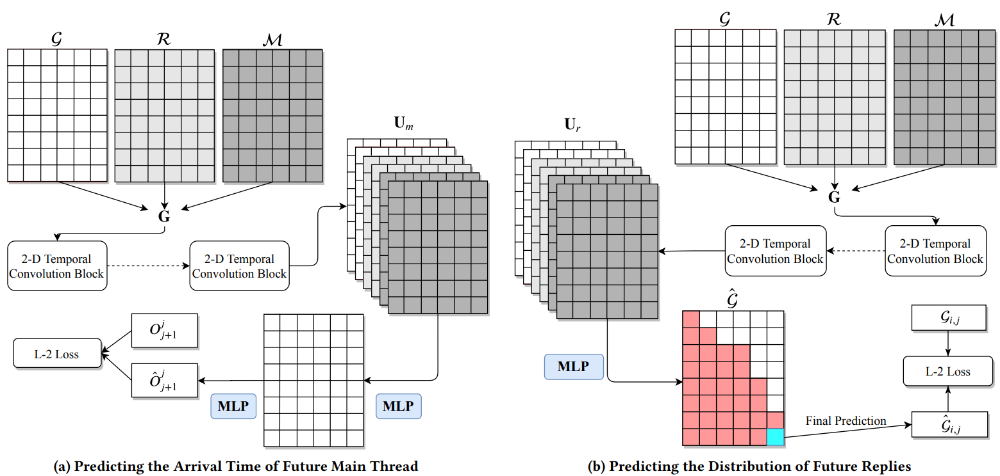

# SocialGrid
A novel framework for forecasting thread dynamics in online discussion forums

This is a implementation of the framework SocialGrid, as described in our paper:  
On Forecasting Dynamics in Online Discussion Forums, IEEE International Conference on Multimedia and Expo, 2021

## Requirements
This code is written in Python. To use it you will need:
- Numpy > 1.16
- Tensorflow > 2.0
- pandas

## Usage
### Run the demo
```
cd SocialGrid
python train_main.py
python train_reply.py
```

### Data
The data used in the paper can be access in the data zipped file. Please extract the zipped file into the folder named `data/` in the folder of SocialGrid to correctly read it.

In order to use your own data, you'll have to provide:
- An N size array recording the arrival time of N main threads
- An N by D ndarray recording the arrival time of D replies of each main threads. Note that the number of D for each replies list can be different. 

[Pushshift](https://github.com/pushshift/api) is an efficient way of searching threads and associated replies on Reddit, which is the data source of our paper.

### Model
The pre_trained models for reply and main event streams can be found in `SocialGrid/pre_trained/` folder.


<p align="center">
  
</p>

<p align="center">
  
</p>

## Cite
```
@article{ling2020socialgrid,
  title={SocialGrid: A TCN-enhanced Method for Online Discussion Forecasting},
  author={Ling, Chen and Wang, Ruiqi and Tong, Guangmo},
  journal={arXiv preprint arXiv:2003.07189},
  year={2020}
}
```
